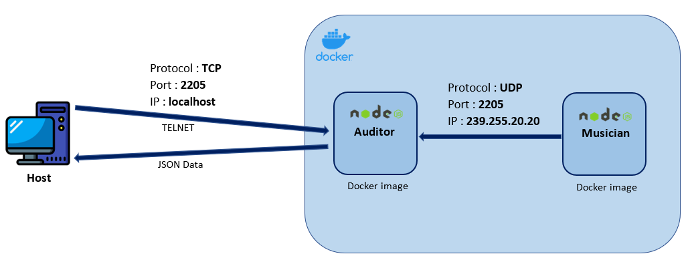

# Teaching-HEIGVD-RES-2020-Labo-Orchestra

###### Alessando Parrino & Dylan Canton

###### 04.06.2021

---

## Admin

* **You can work in groups of 2 students**.
* It is up to you if you want to fork this repo, or if you prefer to work in a private repo. However, you have to **use exactly the same directory structure for the validation procedure to work**. 
* We expect that you will have more issues and questions than with other labs (because we have a left some questions open on purpose). Please ask your questions on Telegram / Teams, so that everyone in the class can benefit from the discussion.

## Objectives

This lab has 4 objectives:

* The first objective is to **design and implement a simple application protocol on top of UDP**. It will be very similar to the protocol presented during the lecture (where thermometers were publishing temperature events in a multicast group and where a station was listening for these events).

* The second objective is to get familiar with several tools from **the JavaScript ecosystem**. You will implement two simple **Node.js** applications. You will also have to search for and use a couple of **npm modules** (i.e. third-party libraries).

* The third objective is to continue practicing with **Docker**. You will have to create 2 Docker images (they will be very similar to the images presented in class). You will then have to run multiple containers based on these images.

* Last but not least, the fourth objective is to **work with a bit less upfront guidance**, as compared with previous labs. This time, we do not provide a complete webcast to get you started, because we want you to search for information (this is a very important skill that we will increasingly train). Don't worry, we have prepared a fairly detailed list of tasks that will put you on the right track. If you feel a bit overwhelmed at the beginning, make sure to read this document carefully and to find answers to the questions asked in the tables. You will see that the whole thing will become more and more approachable.


## Requirements

In this lab, you will **write 2 small NodeJS applications** and **package them in Docker images**:

* the first app, **Musician**, simulates someone who plays an instrument in an orchestra. When the app is started, it is assigned an instrument (piano, flute, etc.). As long as it is running, every second it will emit a sound (well... simulate the emission of a sound: we are talking about a communication protocol). Of course, the sound depends on the instrument.

* the second app, **Auditor**, simulates someone who listens to the orchestra. This application has two responsibilities. Firstly, it must listen to Musicians and keep track of **active** musicians. A musician is active if it has played a sound during the last 5 seconds. Secondly, it must make this information available to you. Concretely, this means that it should implement a very simple TCP-based protocol.


### Instruments and sounds

The following table gives you the mapping between instruments and sounds. Please **use exactly the same string values** in your code, so that validation procedures can work.

| Instrument | Sound         |
|------------|---------------|
| `piano`    | `ti-ta-ti`    |
| `trumpet`  | `pouet`       |
| `flute`    | `trulu`       |
| `violin`   | `gzi-gzi`     |
| `drum`     | `boum-boum`   |

### TCP-based protocol to be implemented by the Auditor application

* The auditor should include a TCP server and accept connection requests on port 2205.
* After accepting a connection request, the auditor must send a JSON payload containing the list of <u>active</u> musicians, with the following format (it can be a single line, without indentation):

```
[
  {
  	"uuid" : "aa7d8cb3-a15f-4f06-a0eb-b8feb6244a60",
  	"instrument" : "piano",
  	"activeSince" : "2016-04-27T05:20:50.731Z"
  },
  {
  	"uuid" : "06dbcbeb-c4c8-49ed-ac2a-cd8716cbf2d3",
  	"instrument" : "flute",
  	"activeSince" : "2016-04-27T05:39:03.211Z"
  }
]
```

### What you should be able to do at the end of the lab


You should be able to start an **Auditor** container with the following command:

```
$ docker run -d -p 2205:2205 res/auditor
```

You should be able to connect to your **Auditor** container over TCP and see that there is no active musician.

```
$ telnet IP_ADDRESS_THAT_DEPENDS_ON_YOUR_SETUP 2205
[]
```

You should then be able to start a first **Musician** container with the following command:

```
$ docker run -d res/musician piano
```

After this, you should be able to verify two points. Firstly, if you connect to the TCP interface of your **Auditor** container, you should see that there is now one active musician (you should receive a JSON array with a single element). Secondly, you should be able to use `tcpdump` to monitor the UDP datagrams generated by the **Musician** container.

You should then be able to kill the **Musician** container, wait 5 seconds and connect to the TCP interface of the **Auditor** container. You should see that there is now no active musician (empty array).

You should then be able to start several **Musician** containers with the following commands:

```
$ docker run -d res/musician piano
$ docker run -d res/musician flute
$ docker run -d res/musician flute
$ docker run -d res/musician drum
```
When you connect to the TCP interface of the **Auditor**, you should receive an array of musicians that corresponds to your commands. You should also use `tcpdump` to monitor the UDP trafic in your system.


## Task 1: design the application architecture and protocols

| #  | Topic |
| --- | --- |
|Question | How can we represent the system in an **architecture diagram**, which gives information both about the Docker containers, the communication protocols and the commands? |
| |  |
|Question | Who is going to **send UDP datagrams** and **when**? |
| | *The musician will send a UDP datagram, it is sent every second (corresponding to each note he plays).* |
|Question | Who is going to **listen for UDP datagrams** and what should happen when a datagram is received? |
| | *The listener will listen to receive UDP datagrams on the specified port.  When it receives a datagram, it will then add the musician (the sender) in a data structure and send it to the client in JSON format.* |
|Question | What **payload** should we put in the UDP datagrams? |
| | *The UUID and the instrument's sound* |
|Question | What **data structures** do we need in the UDP sender and receiver? When will we update these data structures? When will we query these data structures? |
| | *We are going to use a `map` in order to have an Instrument / Sound correspondence.<br />This structure will be updated on both sides (sender and receiver) if we want to add a new musician.  <br />On the sender side, we will use it to get the sound corresponding to the musician's instrument in order to transmit it to the listener.  <br />On the receiver side, we will conversely use it to get the instrument corresponding to the sound received by the musician.* |

## Task 2: implement a "musician" Node.js application

| #  | Topic |
| ---  | --- |
|Question | In a JavaScript program, if we have an object, how can we **serialize it in JSON**? |
| | *JSON.stringify(myObject)*; |
|Question | What is **npm**?  |
| | *It is a Node.Js package manager which also allows the management of dependencies using 2 files: `package.json` and` package-lock.json`.* |
|Question | What is the `npm install` command and what is the purpose of the `--save` flag?  |
| | *This command installs a package and all the packages it depends on in a `node_modules` folder. <br />The ` --save` option allows you to save the installed packages in the dependencies section of the `package.json` file. However, this option is no longer needed since version **5.0.0** of npm because npm automatically saves them with the `npm install` command.* |
|Question | How can we use the `https://www.npmjs.com/` web site?  |
| | *This site allows you to find packages to install later with npm. The site gives us detailed information on each package such as the command to install it, its version, its dependencies, the type of license used.* |
|Question | In JavaScript, how can we **generate a UUID** compliant with RFC4122? |
| | *First we install the package with npm: `npm install uuid`. <br />Then in the code, we include it: `const {v4: uuidv4} = require ('uuid');` <br />Finally, we can generate a UUID with: `uuidv4 ();`* |
|Question | In Node.js, how can we execute a function on a **periodic** basis? |
| | *setInterval(myFunction, intervalInMilliseconds)* |
|Question | In Node.js, how can we **emit UDP datagrams**? |
| | *First we must include a standard Node.js module to work with UDP:  `var udp = require ('dgram');`<br/> Then we create a UDP server:  `var myServer = udp.createSocket ('udp4'); `<br/>You can then emit with: `myServer.send ();`* |
|Question | In Node.js, how can we **access the command line arguments**? |
| | *We access the arguments with the command: `process.argv [noArg]`.  <br />Knowing that : <br />process.argv [0] : Path to the node executable<br />process.argv [1] : Path to the script file<br />process.argv [2] : First argument<br />process.argv [3] : Second argument<br />process.argv [x] : x argument* |

## Task 3: package the "musician" app in a Docker image

| #  | Topic |
| ---  | --- |
|Question | How do we **define and build our own Docker image**?|
| | *docker build -t res/musician ./myDockerfile<br />Where `res/musician` is the name of the chosen image.* |
|Question | How can we use the `ENTRYPOINT` statement in our Dockerfile?  |
| | *ENTRYPOINT [ "node", "musician.js" ]<br /> It defines a list of string corresponding to a command which will be executed when launching the docker, in our case, the launched command will be `node musician.js PARAMETER` where the PARAMETER will be the instrument passing with the `docker run` command.* |
|Question | After building our Docker image, how do we use it to **run containers**?  |
| | *docker run -d -p 2205:2205 res/musician MY_INSTRUMENT* |
|Question | How do we get the list of all **running containers**?  |
| | *docker ps* |
|Question | How do we **stop/kill** one running container?  |
| | *docker kill CONTAINER_ID or docker kill CONTAINER_NAME<br />docker stop CONTAINER_ID or docker stop CONTAINER_NAME* |
|Question | How can we check that our running containers are effectively sending UDP datagrams?  |
| | *We can see the exchange of packets using a network sniffer, like Wireshark.* |


## Task 4: implement an "auditor" Node.js application

| #  | Topic |
| ---  | ---  |
|Question | With Node.js, how can we listen for UDP datagrams in a multicast group? |
| | *You must first create an udp socket, which in this case was created using the dgram module and to be able to receive datagrams from a certain multicast group we need to join it using addMembership method.* |
|Question | How can we use the `Map` built-in object introduced in ECMAScript 6 to implement a **dictionary**?  |
| | _**Map** is a collection of elements where each element is stored as a **{Key, value}** pair. We use it to create a **dictionary** between the instrument and the sound and for storing musicians._ |
|Question | How can we use the `Moment.js` npm module to help us with **date manipulations** and formatting?  |
| | *[Moment.js](https://momentjs.com/) is used to retrieve the current date, and to perform the difference in seconds between two dates of the same format.* |
|Question | When and how do we **get rid of inactive players**?  |
| | *When they have been inactive for more than 5 seconds. If an inactive musician is detected during a TCP connection, it is removed from the list of active musicians.* |
|Question | How do I implement a **simple TCP server** in Node.js?  |
| | *Using the **net** module, we can easily create a TCP server **(net.Server)** using the **`net.createServer()`** method, passing it a function that it should execute once a connection is established. We have additionally indicated the listening port using the **`listen`** method.* |


## Task 5: package the "auditor" app in a Docker image

| #  | Topic |
| ---  | --- |
|Question | How do we validate that the whole system works, once we have built our Docker image? |
| | *To make sure the system worked we first ran **`res/auditor`** containers with the command **"`docker run -d -p 2205:2205 res/auditor`"** so that it would listen on port 2205, then we ran some **`res/musician`** containers with different instruments. Once this was done we verified that with the command **`telenet localhost 2205`** we get a payload containing the list of **active musicians**, we also observed that once a musician container was **stopped/deleted** it disappeared from the json payload after 5 seconds. Finally, for a more in-depth testing we used the script already provided **`./validate.sh`*** |


## Constraints

Please be careful to adhere to the specifications in this document, and in particular

* the Docker image names
* the names of instruments and their sounds
* the TCP PORT number

Also, we have prepared two directories, where you should place your two `Dockerfile` with their dependent files.

Have a look at the `validate.sh` script located in the top-level directory. This script automates part of the validation process for your implementation (it will gradually be expanded with additional operations and assertions). As soon as you start creating your Docker images (i.e. creating your Dockerfiles), you should try to run it.
